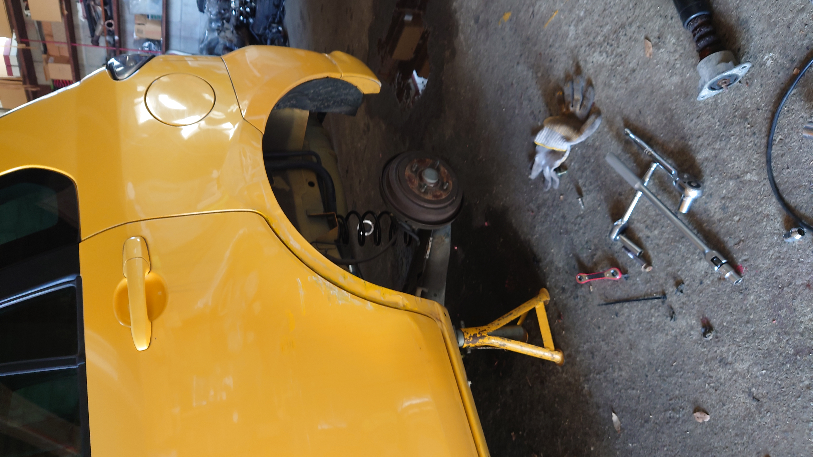

今まで軽自動車(5MTのOTTI→3ATのワゴンR)に乗っていたのですが、またマニュアルに乗りたくなったので車を買い換えました。

## 買った車

デミオ(DY5W後期)を購入しました。1.5LのNAエンジンで5MTです。

購入当時はCUSCOの車高調(左ストラットから異音あり)が入っていました。

また、マフラーがHKSのサイレントハイパワーで、うるさすぎずとてもいい音がします。

他にも車外品がいろいろついていて、とてもお買い得でした。工具もいただいてしまいました。

フロントバンパーと、その奥にある第一メンバー(?)がへこんでいて、左ヘッドライトユニットが落ち込んでいる状態でした。(写真は無理やり元の位置に戻した後です。)

## パーツを交換した

部活の方々の助けもあり、前後の車高調は純正に、ホイールは14インチにインチダウンしました。

また、ステアリングもmomoステから純正に。HIDのバルブも6000kのものに交換しました。

## これからしたいこと
とりあえずはフォグランプがつかないので、それをなんとかしたいですね。

あと、同じ色(ブレージングイエローパールマイカ/マツダ 26S)のバンパーと左ミラーを買って取り替えてしまいたいです。

あとは、スピードメーターを自作したいです。CANでOBD2というデータを拾えるらしいので、ラズパイかなにかを使ってデジタルスピードメーターを作成したいです。