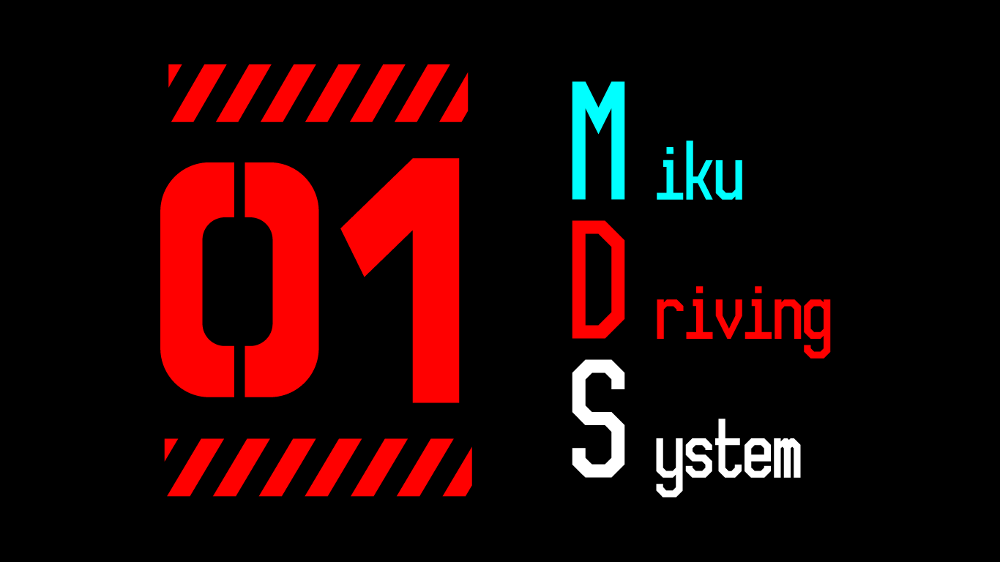

↑仮ロゴ

## ミクドライブシステム(MDS)ってなに

名前からしてたいそうなものを想像された方は申し訳ありません。

車についているスピードメーターなどの計器を自作して、ミクデザインにしてしまおうというものです。

要するに車載ミクスピードメーター。

他に干渉できそうな部分でやる気があれば、機能を増やそうかなと思っています。(オーディオとか一体化してしまうのはあり。)

## アーキテクチャ

### モニタ

本当は今スピードメーターがあるところに埋め込みたいけれど、いい方法が思いつかない。

とりあえずソフトウェアの実験の意味もかねてオンダッシュモニター上に表示させようと思っている。

### コンピュータ

ラズパイの互換ボードが手に入りやすくてよさそう。

耐久性...?だいじょうぶでしょ（適当）

### ラズパイ(互換)でCANする

調べたらあったのでぽちった。

[MCP2515](https://www.amazon.co.jp/dp/B01GF75R0O/ref=cm_sw_r_tw_dp_V0A0YSH7TDSD8MBA94KJ?_encoding=UTF8&psc=1)

互換で動くかはどうかはわかりませんが、やってみます。

### SPI通信
さすがはラズパイ、ドライバでなんとかできるみたいです。

[Raspberry Pi で CAN通信（準備） | キルロボブログ](http://www.kirurobo.com/2017/12/raspberry-pi-can.html)

### バックエンド&フロントエンド
HTML前提で書きましたが、重そう。リアルタイム性が重視されるのでしんどいかも...?

要テスト。違和感なければなれているので楽。

Electronとかでもいいけど、解決になってなさそう。

Processingで実行ファイルにしてしまうのもいいかもしれない。

けど、こんどはデザインを作るのが難しそう。でもProcessingいいかもしれない。

でも、ミクを表示させることができないかもしれない。

できるだけ負荷の少ない形かつ反映は早くという感じで実装したい。全然思いつかない。

## とりあえずすること

互換ボードを購入して、ECUとCAN通信する。これができれば、あとは多分GUI書くだけなので、なんとかなるとおもいます。

