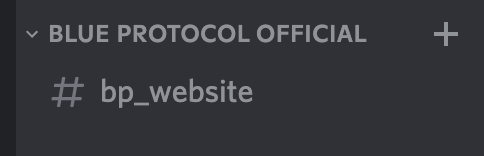

## BLUE PROTOCOLのお知らせをDiscordに通知してくれる

名前の通り、BLUE PROTOCOL公式サイトのお知らせが更新されたら、Discordのサーバーにメッセージを送ってくれます。

是非招待して使ってみてください。完全に個人で運営しています。

~~お知らせが更新されないから~~定期的にお知らせページをみにいくのも面倒だからと思って作りました。

## ブルプロお知らせDiscord Botの使い方

### 招待

まず、Discord Botを以下のリンクから招待します。

[BLUE PROTOCOL公式サイト 更新お知らせ](https://discord.com/oauth2/authorize?client_id=880065781889630319&permissions=34359757824&scope=bot)

招待にはそのサーバーの管理者権限が必要です。

### チャンネルの作成

そのままでは動かないので、bp_websiteという名前のテキストチャンネルを作成します。カテゴリはなんでも大丈夫です。

### 動作確認

動作に問題がないか確認するために、どこのチャンネルでも良いので、「BP大丈夫？」と送信してください。導入が成功していれば、先ほど作成したbp_websiteチャンネルに、「大丈夫です！」と返答があるはずです。

返答がない場合は、チャンネルの名前や、Botに適切な権限が与えられているかをもう一度確認してください。

### アップデートについて

将来的には、メンテナンスの状況をお知らせできるようにしたりその他便利機能を追加するつもりです。また、アップデートを行った際は、このサイトもしくはBotからのメッセージとして通知させていただきます。

### サポート

このBotは私が個人で運営しています。Botに記載のDiscordアカウントもしくは、このサイトに記載のTwitterに連絡をくだされば、対応できる範囲で対応させていただきます。

## 最後に

BLUE PROTOCOL、楽しみに待っています。さまざまな意見がありますが、アニメ調のMMOというだけで正直嬉しいです。欲を言うと、生活系コンテンツは充実して欲しいなぁと思います。

このDiscord Botが、少しでも皆様のお役に立てれば嬉しいです。

