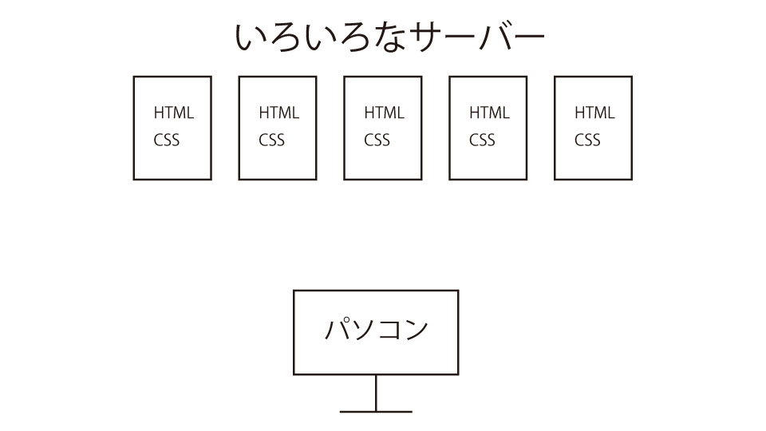

## HTTP?なにそれ
一言で言ってしまえば、ブラウザとサーバーの間の通信プロトコルです。

...それで理解できたら困っていないはずなので、初心者の方にもわかりやすいように少し丁寧に説明したいと思います。

## そもそも...
パソコン？よくわからん。でも、今からできるようになりたいな...

そんな人が、サーバーとかブラウザとかプロトコルとか、そんなこと言われても何が何だかわからないと思います。

ので、私たちはどのようにしてウェブページを見ているのかを解説していきます。

厳密な話はしていませんので、そのような説明を求められている方は、満足できないかもしれません。ご了承ください。

### webページの中身
たとえば、このサイトも、ただただ文書が白黒で書かれているだけではなく、見出しに色がついていたり、画像が張ってあったり、Twitterへのリンクが張ってあったりする訳です。

しかし、たとえばWindowsの機能であるメモ帳に、画像だったり色だったりリンクを張ったりすることはできないと思います。ただの文章に、そのような機能はないからです。

しかし、それでは不便なので、昔の人は「Hypertext」というものを作りました。

それによって、ウェブサイトでリンクに飛べたり、画像を見たりすることができるわけです。

webページでは、大半の場合「HTML」と言われる上述のハイパーテキストを書くルールを使って書かれています。そして、「CSS」というものを使って、色や見た目を整えています。

### Webページを見る
Webページが何でできているかはわかりました。

では、どのようにして、様々なサイトの情報を見ることができるのでしょうか。

インターネット上には、様々な情報がありますが、それぞれ違う「サーバー」に置いてあります。(図参照)

では、どのようにして特定のサーバーからHTMLをもらってくるのでしょうか。

そこで、役に立つのがブラウザです。今お使いのブラウザの上部または下部に、"sayagi.net"などと書かれたものがあるかと思います。これはURLと言って、今見ているコンテンツの住所を指し示しているものです。

簡単に言ってしまえば、sayagi.netにブラウザを使ってアクセスすると、私が管理しているサーバーにつながり、そこからHTMLがもらえるわけです。そのHTMLをブラウザが表示して、Webページを見ることができる訳です。

## HTTPとは
Webページが表示される仕組みは、なんとなくわかっていただけたと思います。

いよいよ、HTTPについての説明に移ります。

ブラウザが、サーバーからHTMLをもらうことになる訳ですが、ただそこにいるだけではHTMLをもらうことはできません。「HTMLください！」とリクエストしなければいけません。

そこで使われるのがHTTPな訳です。

たとえば、フランス語しか話せない人に、日本語で「ください！」と言っても、何も伝わらないでしょう。そのようなことを防ぐために、サーバーとブラウザの間で使う言葉のルールを決めてあげる必要があります。

それが、HTTPな訳です。

かなりざっくりとした説明になってしまいましたが、HTTPとは何なのかについて、少しでも理解の助けになっていればうれしいです。